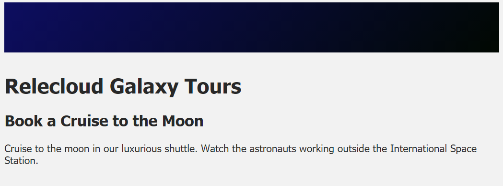

In this section, you'll create a starter Vue application using an HTML file that is linked to the Vue core library and an external JavaScript file that contains the application details. You'll also define one Vue data variable and display it dynamically within the HTML page.

## Clone the starter repository

We have provided a starter site for the application which includes images and a base style. We will start by cloning the repository and opening it in Visual Studio Code.

1. Open a terminal or command window and execute the following commands:

    ```bash
    git clone [INSERT REPO PATH]
    cd [INSERT PATH]
    code .
    ```

## Link to the Vue core library in your HTML file

You'll install Vue.js from the CDN.

1. Inside Visual Studio Code, open **index.html**
1. Install Vue.js by linking to the Vue core library, paste the following script tag into your starter **index.html** file below the comment that reads `TODO: Import Vue.js core library`.

    ```html
    <!-- TODO: Import Vue.js core library -->
    <script src="https://unpkg.com/vue@next"></script>
    ```

## Create a separate JavaScript file for your Vue application

You can start writing Vue script inside your HTML file if you want, but it's typically cleaner to manage your application if you place the code in a separate JavaScript file.

1. Create a new file named **index.js**
1. Add the following code to **index.js** to create the app

    ```javascript
    const app = Vue.createApp({
        data() {
            return {
                productName: 'Book a Cruise to the Moon',
                productDescription: 'Cruise to the moon in our luxurious shuttle. Watch the astronauts working outside the International Space Station.',
                // additional properties later
            }
        },
    });
    ```

    The `createApp()` function is available to you because you imported the Vue.js library into the `<head>` tag of your HTML page. You then pass an argument for this function as an object with a `data` property. This object returns another object that you will use to store your data.

## Import and mount the application

With your JavaScript file created, you can now import and mount the application.

1. Return to **index.html**
1. Below the comment which reads `TODO: Import Vue app` add the following:

    ```html
    <script src="./index.js"></script>
    <script>
        app.mount('#app');
    </script>
    ```

## Use the Vue application

With your Vue application created and imported, you can now create the display for the information.

1. Inside **index.html**, below the comment which reads `TODO: Add information display` add the following HTML:

    ```html
    <div id="app">
        <h2>{{ productName }}</h2>
        <div>{{ productDescription }}</div>
    </div>
    ```

> [!IMPORTANT]
> IMPORTANT: Note that page execution order is important in Vue.js processing. You cannot attach your application to the DOM, until the HTML page is fully loaded. Therefore, you import the Vue application at the bottom of the page after all other HTML elements have been loaded into the browser. It's generally a good idea to let the HTML page load, before calling an external script file, that is intended to change the content or structure of the DOM.

## Launch the page with Live Server

The [Live Server](https://marketplace.visualstudio.com/items?itemName=ritwickdey.LiveServer) extension for Visual Studio Code creates a development web server which will automatically refresh the page as changes are detected. After installing the extension (by clicking on the link if you haven't already), you can use it to host your page.

1. Save all files
1. Open the command palette in Visual Studio Code by hitting **Ctl-Shift-P** (or **Cmd-Shift-P** on a Mac)
1. Type **Live Server: Open with Live Server**

    A dialog will open in the bottom right saying your page is now being hosted on [http://localhost:5500](http://localhost:5500).

1. Open a browser and navigate to [http://localhost:5500](http://localhost:5500)

You should now see the page you created!


