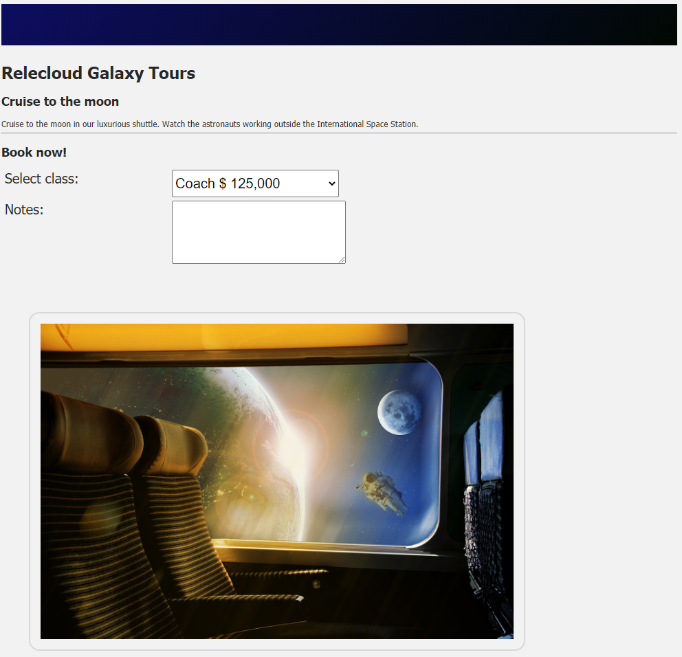

Let's update a fictitious application for allowing people to book cruises into space. We will add a form to allow someone to book a trip to the moon.

## Exploring the starter code

The starter application already contains the core data model we will use. The `product` has information about the cruise itself, including the list of available `cabins`. The `booking` object is what we will use to store the options the user selects for their reservation. You can see the setup inside **index.js**.

## Create the form

Let's create the form the user will use to setup their reservation.

1. Inside Visual Studio Code, open *index.html*
1. Below the comment which reads `TODO: Add booking form`, add the following HTML

    ```html
    <!-- TODO: Add booking form -->
    <form v-show="!booking.completed">
        <h2>Book now!</h2>
        <div class="row">
            <label for="product-cabin">Select class:</label>
            <select id="product-cabin" v-model="booking.cabinIndex">
                <option v-for="(cabin, index) in product.cabins" :value="index">
                    {{ cabin.name }} $ {{ cabin.price.toLocaleString('en-US') }}
                </option>
            </select>
        </div>
        <div class="row">
            <label for="notes">Notes:</label>
            <textarea v-model="booking.notes" rows="3"></textarea>
        </div>
        <div class="row">
            <!--TODO: Add button later -->


        </div>
    </form>
    ```

## Breaking down the code

Let's walk through HTML code you added to the page.

### form element

```html
<form v-show="!booking.completed">
```

The `form` element is a normal HTML form element. The key attribute we have added is `v-show`, which allows you to toggle the display of an item in Vue.js. If `booking.completed` is false we will display the form (making note of the `!` at the beginning of our string), otherwise we will hide it.

### select element for cabin

```html
<select id="product-cabin" v-model="booking.cabinIndex">
    <option v-for="(cabin, index) in product.cabins" :value="index">
        {{ cabin.name }} $ {{ cabin.price.toLocaleString('en-US') }}
    </option>
</select>
```

We display the list of available cabins by using a `select` element. We want to bind the selected value, which will be the index, to `booking.cabinIndex`. The list of available cabins is in `product.cabins`, so we use `v-for` to create the list of options for the dropdown. We set the `value` of each one to the `index`, and create a display of the `name` of the cabin and its `price`.

### textarea for notes

```html
<textarea v-model="booking.notes" rows="3"></textarea>
```

 We bind the `booking.notes` option to a `textarea`. We set the size by setting the `rows` attribute to *3*.

 ### The todo comment

 You will notice we added a `TODO` comment for ourselves to add in a button. We will see how to create event handlers a little later in this module. We want to make sure we know where to place it when the time comes.

 > ![NOTE]
 > `TODO` comments are a great way to make notes in your code of tasks you need to complete in the future.

 ## Test the results

 Let's see our updated page!

 1. Save all files by clicking *File* > *Save all*
 1. Ensure *Live Server* is running by pressing *Ctl-Shift-P* (or *Cmd-Shift-P* on a Mac), typing *Live Server* in the command pallet, and selecting *Live Server: Open with Live Server*
 1. Open your browser and navigate to **http://localhost:5500**
 1. The page now displays

    

You have now bound Vue data to a form.
