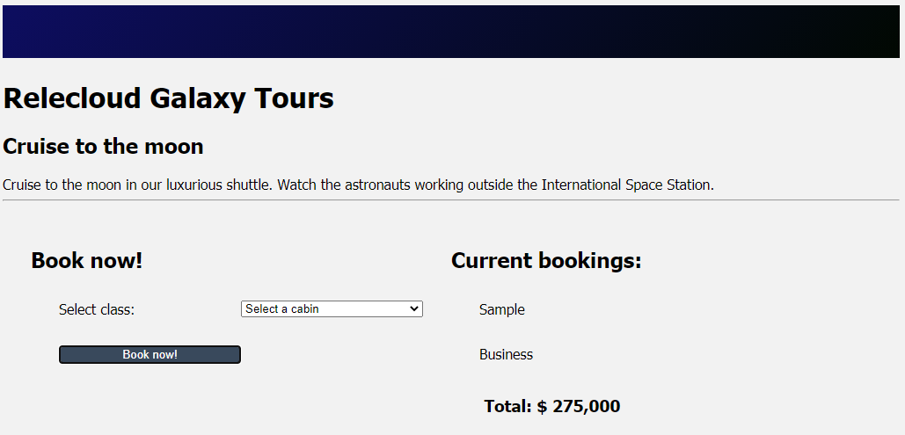

Let's complete our application by adding a form the user can use to book a cruise. The form will have a dropdown list for the user to select their desired cabin, and a button to book the cruise. We will set this up as a new component, and create an event for the button. We will finish by calling this new component from `Host.vue`.

## Create the component

We will start by creating the component.

1. Inside Visual Studio Code, create a new file in *src/components* named *BookingForm.vue*
1. Inside *BookingForm.vue*, type `vue`, and select *\<vue\> with default.vue* from the snippets menu

    

    The default structure will be created by the snippet.

## Add the code for the component

Let's add the code the component will use, including registering the props, emits, data and methods.

1. Open *src/components/BookingForm.vue* if not already open
1. Inside the curly braces (`{ }`) for `export default`, add the following code to configure the component

    ```javascript
    props: {
        cabins: Array,
    },
    emits: ['bookingCreated'],
    data() {
        return {
            cabinIndex: -1
        }
    },
    methods: {
        bookCabin() {
            if(this.cabinIndex < 0) return;
            this.$emit('bookingCreated', this.cabinIndex);
            this.cabinIndex = -1;
        },
    }
    ```

    This code starts by creating a `cabins` prop to display the list of available cabins. We expose one event named *bookingCreated* by using `emits`. We create a data item named `cabinIndex` to store the selected cabin index.

    We finish by creating a method named `bookCabin`. `bookCabin` checks the value of `cabinIndex`, and only runs if the value is 0 or greater (meaning the user selected a cabin). If this validation passes, we emit the event returning the selected `cabinIndex`, and resets the `cabinIndex` to -1.

## Add the display template

With the code added we can turn our attention to the display. We want to have a dropdown list for cabin selection, and a button to book the trip. The button will call the `bookCabin` function we created earlier.

1. Open *src/components/BookingForm.vue* if not already open
1. Add the following code inside the `<template>` tags to create the display:

    ```html
    <section>
    <h2>Book now!</h2>
    <form>
        <div class="row">
            <label for="cruise-cabin">Select class:</label>
            <select id="cruise-cabin" v-model="cabinIndex">
                <option disabled value="-1">Select a cabin</option>
                <option v-for="(cabin, index) in cabins" :value="index" :key="index">
                    {{ cabin.name }} $ {{ cabin.price.toLocaleString('en-US') }}
                </option>
            </select>
        </div>
        <div class="row">
            <button class="button" type="button" @click="bookCabin">Book now!</button>
        </div>
    </form>
    </section>
    ```

    The HTML creates our form. We loop through the `cabins` prop by using `v-for` to create the dropdown list. We bind the model of the `select` tag to the `cabinIndex` which will be returned back when the user selects a cabin and clicks the button. We then setup the button to call `bookCabin` when clicked.

## Add BookingForm to the page

We will finish by adding the newly created `BookingForm` to our application by adding it to *Host.vue*.

1. Open *src/components/Host.vue*
1. Import `BookingForm` by adding the following code after the comment which reads `TODO: Register next component`:

    ```javascript
    import BookingForm from './BookingForm.vue';
    ```

1. Add BookingForm to the list of available components by adding the following code after the comment which reads `TODO: Add next component`:

    ```javascript
    BookingForm
    ```

1. Add the method to handle the `bookingCreated` custom event by adding the following code after the comment which reads `TODO: Add methods`:

    ```javascript
    methods: {
        addBooking(cabinIndex) {
            const cabin = this.cruise.cabins[cabinIndex];
            const booking = {
                cabin: cabin.name,
                price: cabin.price
            }
            this.bookings.push(booking);
        }
    },
    ```

    `addBooking` retrieves the selected cabin by using the index, and creates a new `booking` object by using `cabin.name` and `cabin.price`. We then add the `booking` to the `bookings` array.

1. Use the `booking-form` component by adding the following after the comment which reads `TODO: Add booking-form`

    ```html
    <booking-form @booking-created="addBooking" :cabins="cruise.cabins"></booking-form>
    ```

    We connect the `addBooking` function to the `booking-created` event, and pass the list of cabins for display.

## Test the page

With all the code added, let's test the page!

1. Save all files by clicking *File* > *Save all*
1. Navigate to [http://localhost:8080](http://localhost:8080) and refresh the page
1. Select a cabin from the dropdown list and click the button
1. Your new booking will be displayed on the right

    

You have now created and called a component with a custom event!
