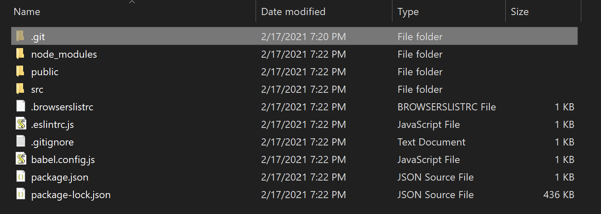
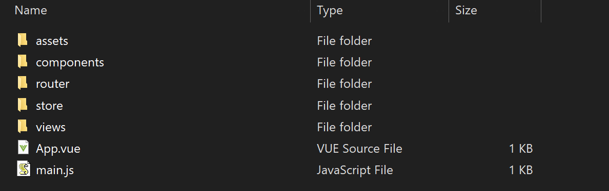

You've used the CLI to create a basic Vue single file application. This application also uses Vue components so you have the basic framework in place to build a Vue app. This is the beauty of the CLI: it does all the foundational work for you so you can focus on building your application.

In this and subsequent topics, we'll be developing a single-page application (SPA) using Vue. If you're not familar with the concept of a SPA, the model essentially rebuilds a single page with updated data from a server or based on user entry--thus the name single *page* application. In traditional web design, updated information would be sent to the user in a new page. This Wikipedia page has a good introduction to single-page applications if you want to read more: https://en.wikipedia.org/wiki/Single-page_application.

## Vue SPAs

### Main Application

The CLI will install all the files you need for a single-page application. When the scripts are finished running, your folder structure should look something like this:

The main files for the application are in the `src` folder. If you open that folder, you'll see the following files:

The entry point code for your JavaScript application is in `main.js` and in this file you import the Vue libraries and the main Vue app file called `App.vue`. Notice the `.vue` extension on this (and other) files. We'll talk more about this file type in the next topic. 

The `App.vue` file is of particular importance in this model as it not only harnesses the main functionality of the application but also demonstrates routing in Vue--a primary feature that gives SPAs their power. You learned about Vue routing earlier in this course.

Note that this application cannot be consumed natively on the web as is. It has to be 'built' which you learned about in the topic on the CLI. A tool like the Vue builder, Webpack, or Snowpack handles creating all the files needed so a web server like Node.js can serve the files to the user over the internet.

### Other Files

In the `views` folder you'll see two other `.vue` files: `Home.vue` and `About.vue` which contain the code and content for those repsective pages (though if you look inside `Home.vue` you'll notice it loads `HelloWorld.vue` which contains the main body content of the home page). In Vue, these types of files--files with the `.vue` extension--are called "components." When the user requests these components, the Vue router loads them into the viewport of the application without having to redirect the user to a different page. This decreases load time for the user and helps create the "application" experience in this web application.

The folder structure of this application is very intentional. The builder and router looks for specific files in specific folders. While these can be changed with configuration files, the basic structure of this application is what the builder expects. 

## Conclusion

Now that you have a basic understanding of how a Vue SPA is structured, we can take a look at `.vue` files themselves so you can understand how to write your own and start builing more powerful Vue applications.