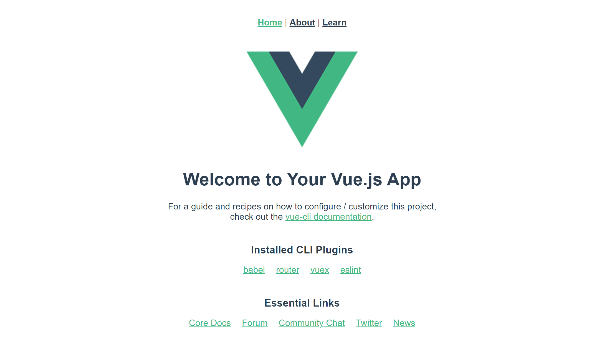

The exercise will have them take the basic application created by the CLI template and expand it. Let's add another component to the application and create a route so Vue can load that into the application when the user wants it. 

We'll call this new page "Learn" and we'll provide some basic resources on how a user can get started with Vue.

1. In Visual Studio Code, open the folder from the project you created using the CLI. This will give you access to all the project files so you can edit them.
2. Using the Visual Studio Code Explorer, navigate to the `src` folder and expand it.
3. Open the `App.vue` file so we can add a new route to our learn page. Below the last route in the `template` section, add the following line and save the file:

` | <router-link to="/learn">Learn</router-link>`

4. Now let's create the page. Find the `views` folder under `src`, right click and select **New File**. Name the file `Learn.vue`.
5. Paste in the following code and save the file:
   
    ```html
    <template>
        <h1>This is the Learning Page!</h1>
    </template>
    ```

    This is the HTML that will render when the page loads. You can add whatever else you would like including links. Use the `Home.vue` and `About.vue` files as a template.

6. Now lets ensure the routes work. Open the `router` folder in Visual Studio Code Explorer and open the `index.js` file. 
7. Add a route to the `const routes` variable by typing a comma after the last route in the JSON list (the default is the "About" route) and add the following code and save the file:

    ```javascript
    {
        path: "/learn",
        name: "Learn",
            component: () =>
            import(/* webpackChunkName: "about" */ "../views/Learn.vue")
    }
    ```

That's it! You just added your first Vue component with a route to the new page. If you run `npm run serve' you should see a page that looks similar to the one below. If you click on the "Learn" link, Vue will load your new page into the viewport.  


