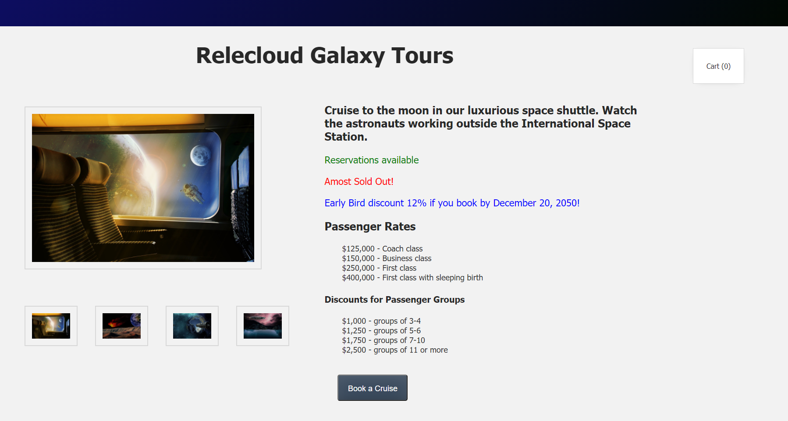

Let's take a quick look at the web application we will build in this course. You can create your own files for the activities described in this module, or you can use the files and assets that are available in our [`starting code`](link).

Suppose you work for an exciting new start-up company named **Relecloud Galaxy Tours**. It is your job to set up a web application that will allow people to book tours and additional tour package options for cruise trips throughout the galaxy. As a first step, passengers will need to book a cruise to the moon. From there they can depart from a moon-based space station to explore other parts of the galaxy by adding tour enhancements such as a Meteor Fireworks Display, a Bullet Train that travels through the center of the Earth, and a Ride-Along in an alien spaceship to watch titanium mining on the moon.

In the image below, a photo on the left highlights the shuttle that passengers will ride when they book a cruise. Below the main image are photos of additional tour enhancements that can be purchased for the trip. When a user clicks the button to "Book a Cruise", the Cart count will be incremented by 1. In addition, the photo will be changed to display one of the tour package options that can be added to the trip, and the button will then read "Add this Option."

We will also create a form that allows users to select their amenity preferences for food, such as gluten-free, vegan, sugar-free, and low sodium.

