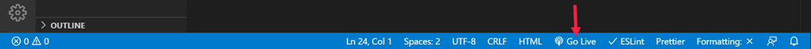
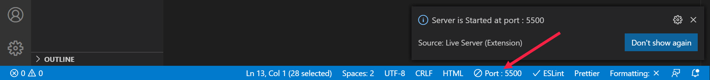
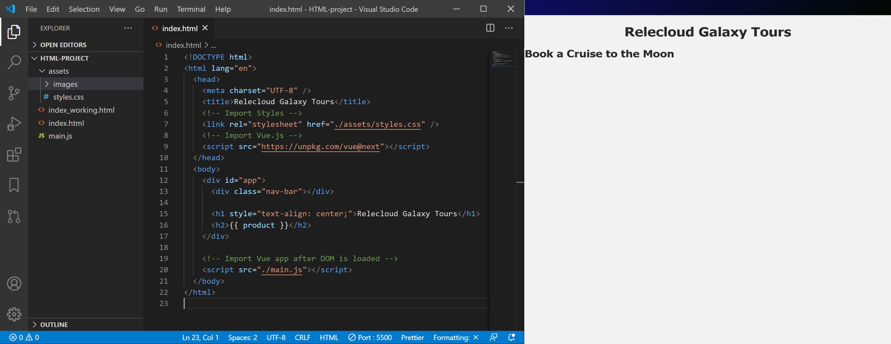

In this section you will create a starter Vue application using an HTML file that is linked to the Vue core library and an external JavaScript file that contains the application details. You will also define one Vue data variable and display it dynamically within the HTML page.

## Step 1: Link to the Vue core library in your HTML file

To install Vue.js by linking to the Vue core library, paste the following script tag into the starter HTML file.

```html
<!-- //TODO: link to the VueJS core library within the <head> tag of your HTML file -->
<script src="https://unpkg.com/vue@next"></script>
```
Your **index.html** page should now look like the example shown below.

```html
<!DOCTYPE html>
<html lang="en">
  <head>
    <meta charset="UTF-8" />
    <title>Relecloud Galaxy Tours</title>
    <!-- Import CSS Styles -->
    <link rel="stylesheet" href="./assets/styles.css" />
    <!-- //TODO: link to the VueJS core library within the <head> tag of your HTML file -->
    <script src="https://unpkg.com/vue@next"></script>
  </head>
  <body>
    <h1>Product name goes here</h1>
  </body>
</html>
```

> [!TIP]
>The [official Vue page](https://vuejs.org/v2/guide/installation.html) provides installation information and the latest CDN link that you can paste into any HTML page where you want to enable Vue.js. We are using version 3.0 of Vue.js for this training. You can also refer to the [Progressive JavaScript Framework](https://v3.vuejs.org/) webiste for more information about Vue.js version 3.

## Step 2: Create a separate JavaScript file for your Vue application

Now we can start writing Vue script inside our HTML file if we want to, but it is much cleaner and easier to update our application if we place the Vue data into a separate JavaScript file. Let's create a **main.js** file for this purpose.

On the first line instantiate (create an instance of) your Vue application using a `constant` named `app`. Also define a data item **productName** with a value of **Book a Cruise to the Moon**. Your **main.js** file should now contain the code snippet below.

```javascript
//TODO: Create the VueJS app using a constant named app
const app = Vue.createApp({
    data() {
        return {
            //TODO: Define a data property item as productName with a text value
            productName: 'Book a Cruise to the Moon'
        }
    },
})
```

> [!TIP]
> TIP: The full code for this data property would be `data: function()`, but Vue allows an ES6 shorthand notation that lets us remove the colon (:) and the word 'function' so the resulting code is simply `data()`. ES6 stands for ECMAScript 6, which was created to standardize JavaScript. ES6 is the 6th version of ECMAScript. Vue requires at least ECMAScript 5, which is common in most modern browsers.

The `createApp()` function is available to us because we imported the Vue.js library into the `<head>` tag of our HTML page. We then pass an argument for this function as an object with a `data` property. This object returns another object that we will use to store our data.

## Step Three: Mount the Vue Application

In addition to importing the Vue app that is defined in our JavaScript file, we need to mount our Vue application into the DOM so that Vue can track the current state of different objects in our HTML page. To accomplish this, we add another construct at the bottom of the main.js file to mount the Vue app into the DOM.

Inside the mount method we have an argument `#app`, which is a DOM selector used to plug the app into a piece of our DOM.

```javascript
//TODO: add another construct under the app construct to mount the Vue app into the DOM
const mountedApp = app.mount('#app')
```

## Step Four: Link to the Vue application at the bottom of your HTML file

Next we link to our Vue application in the HTML file. Perform this task as shown in the code snippet below.

```html
<!-- //TODO: Import Vue app after DOM is loaded -->
    <script src="./main.js"></script>
  </body>
</html>
```

> [!NOTE]
> NOTE: When a web page is loaded, the browser creates a DOM (Document Object Model) of the page. The HTML DOM model is constructed as a tree of Objects. This provides JavaScript with all the power it needs to change elements, attributes, and CSS styles within an HTML document, thus enabling the creation of dynamic HTML on the front end. An image and further explanation of the DOM is available on the [W3 Schools website](https://www.w3schools.com/js/js_htmldom.asp).

## Step Five: Identify the Vue app within the DOM

To identify the Vue app within the DOM we wrap a `<div>` tag around the parts of our HTML code where we want to plug in pieces of data being tracked by our Vue application.

Then we need to tell our HTML page where to display the piece of `data` we have defined for our `product`. So, replace the literal text in your `<h2>` tag with a VueJS variable name placed inside double curly braces `{{ variable }}`.

After accomplishing these tasks, your **index.html** should be structured as shown below.

```html
<!DOCTYPE html>
<html lang="en">
  <head>
    <meta charset="UTF-8" />
    <title>Relecloud Galaxy Tours</title>
    <!-- Import CSS Styles -->
    <link rel="stylesheet" href="./assets/styles.css" />
    <!-- Import Vue.js core library -->
    <script src="https://unpkg.com/vue@next"></script>
  </head>
  <body>
    <!-- //TODO: Wrap a <div> tag around the HTML content that you want to manipulate with VueJS -->
    <!-- //TODO: Opening <div> goes below -->
    <div id="app">
      <div class="nav-bar"></div>
      <h1 style="text-align: center;">Relecloud Galaxy Tours</h1>
      <!-- //TODO: replace literal text with a defined variable (surrounded by double curly braces) -->
      <h2>{{ productName }}</h2>
    <!-- //TODO: Ending <div> goes below -->
    </div>
    <!-- //TODO: Import Vue app after DOM is loaded -->
    <script src="./main.js"></script>
  </body>
</html>
```

> [!IMPORTANT]
> IMPORTANT: Note that page execution order is important in VueJS processing. We cannot attach our application to the DOM until the HTML page is fully loaded. Therefore, we import the Vue application at the bottom of the page after all other HTML elements have been loaded into the browser. It is generally a good idea to let the HTML page load before calling an external script file that is intended to change the content or structure of the DOM.

You should now be able to view the HTML page in your browser to see that the words "Product name goes here" have been replaced with the words "Book a Cruise to the Moon." You can just double-click on the index.html file to open it in a browser on your local computer. However, if you installed the Live Server extension in VS Code, you can open a live view of your HTML page that will be updated immediately every time you make a change and save the file. To do this, start the server by clicking the "Go Live" link in the blue footer at the bottom of the screen.



You will briefly see text indicating that the server is starting, and the Go Live icon will be replaced with the name of the Port where the live server is running.



You can then open the page in the live server by using two consecutive keyboard commands: **Alt+L** followed by **Alt+O**. Note that the browser will not be displayed inside the VSCode editor, but rather will appear in a separate browser window. In the image below you can see VS Code on the left and an Edge browser running on the live server on the right.



This immediate update of the page in the Live Server demonstrates the **Reactivity** feature of VueJS. Reactivity refers to the fact that data values and their related properties are updated immediately in the HTML interface as soon as a change is made in the Vue application. Since there is no need for the browser to request information from an external server and wait for a response, Vue.js is able to make updates to the structure and content of your webpages very quickly.
