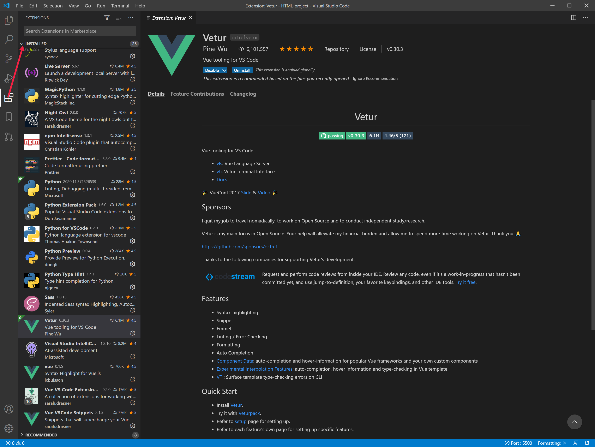

To follow along with the exercises and coding examples described in this learning path, you will want to use a code editor. While a simple text editor such as **Notepad** on a Windows machine or **TextEdit** on a Mac would work, we will be using [Visual Studio Code](https://code.visualstudio.com), an open source code editor. You are of course free to use whatever editor you prefer. You can refer to the [Visual Studio Code download page](https://code.visualstudio.com/download) for instructions on installation for Windows, macOS and Linux.

We will demonstrate this project using **VS Code**. You can download and set up a free version of VS Code for the Windows, Mac or Linux platforms from the [Visual Studio download site](https://code.visualstudio.com/download). After completing the VS Code installation, you will also want to install the following extensions:

- Vue (syntax highlighting for Vue.js) - jcbuisson
- Vue VSCode Snippets - sarah.drasner
- Vetur - Vue tooling for VS Code - Pine Wu
- Live Server - Ritwick Dey

You can see a list of installed extensions in Visual Studio Code by clicking the four-block icon in the left column of the VS Code interface. You can use the search bar at the top of that column to find a specific extension. Clicking the name of any extension will load a detailed description and installation information in the right panel. Getting started information and instructional videos for VS Code are available at the [Visual Studio website](https://code.visualstudio.com/docs/introvideos/basics).

