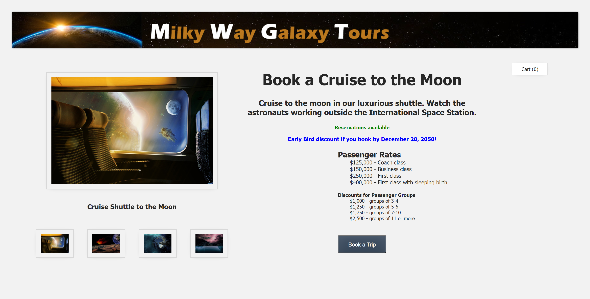
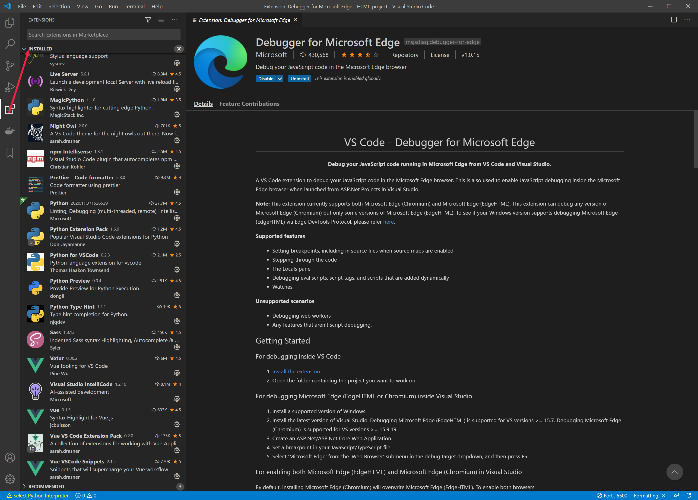
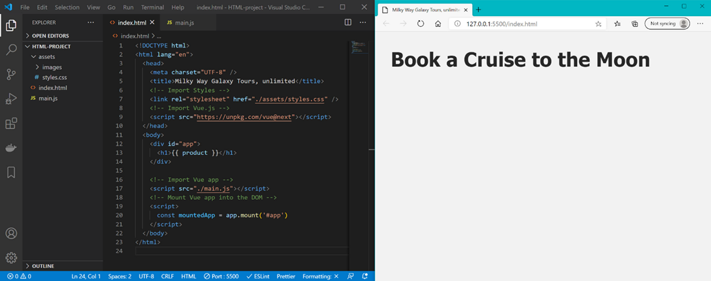

## Learning Objectives

Upon completion of this module you will be able to:

- Understand why Vue.js was developed and how it can be implemented in two ways

- Preview a web product display page that you will develop in this course

- Select and install a code editor

- Create a simple Vue app and display it in a browser

## Overview

**Vue.js** was created by Evan You and first released in February 2014. His objective in developing Vue was to create a progressive, lightweight version of JavaScript. It was designed to allow developers to create a user interface by adding a set of custom HTML attributes that connect software components with data. To accomplish this, Vue.js interprets the HTML attributes as *directives* that bind input or output parts of the page to a model that is represented by standard JavaScript variables. You can easily add the Vue core library to any page and immediately start creating dynamic HTML markup with powerful data binding and event handling features.

Vue is described as *progressive* because you can adopt it incrementally by adding functionality available in a library to power sophisticated single-page applications without needing to re-write your existing framework. Vue is also flexible enough to be configured with back end applications that rely on an external database or a Web server such as Node.

Vue.js is an open-source *modelviewviewmodel* (MVVM) *front end* JavaScript framework. MVVM is a software design pattern that is structured to separate program logic and user interface controls. Front end refers to the user interface, which is generally a web browser or computer-based application. Values of the JavaScript variables can be manually set within the code on the front end or retrieved from static or dynamic resources such as JSON data files. Back end refers to an external server that generally contains an external database and server application that retrieves and processes information, which is then returned to the front end for display to the user.

Like many other design patterns, MVVM helps organize code into modules to make development, updating and reuse of code simpler and faster. **Model** refers to either a domain model, which represents real *state* content (an object-oriented approach), or to the data access layer, which represents the content. **View** refers to the structure, layout, and appearance of what a user sees on the screen, i.e., the user interface. The View displays a representation of the model and receives the user's interaction through mouse clicks, keyboard input, screen tap gestures, etc. It then forwards the handling of these inputs to the **Viewmodel**, which can be described as the *state of the data* within the model.

*The core library of Vue.js is focused on the View layer only*, and that will be the focus of these initial training modules. Additional tools are needed to create more complex Vue applications. We will address those concepts and the Vue CLI in later modules within this course. First, let's focus on functionality available through the core library.

## Unit: Overview of web application

Let's take a quick look at the web application we will build in this course.

Suppose you work for an exciting new start-up company named *Milky Way Galaxy Tours, unlimited*. It is your job to set up a web application that will allow people to book various tours throughout the galaxy. As a first step, passengers will need to book a cruise to the moon. From there they can depart from a moon-based space station to explore other parts of the galaxy by adding tour enhancements such as a Meteor Fireworks Display, a Bullet Train that travels through the center of the Earth, and a Ride-Along in an alien spaceship to watch titanium mining on the moon.

In the image below, a photo on the left highlights the shuttle that passengers will ride when they book a cruise to the moon. Below the main image are photos of additional tour enhancements that can be purchased for the trip. When users click the button to "Book a Trip", the Cart count will be incremented by 1. In addition, the photo will be changed to display one of the tour highlights that can be added to the trip, and the button will then read "Add this Option."

We will also create a form that allows users to select their amenity preferences for food, such as gluten-free, vegan, sugar-free, and low sodium.




## Unit: Select a Code Editor

To follow along with the exercises and coding examples described in this training, you will want to use a code editor. You can use a simple text editor such as *Notepad* on a Windows machine or *TextEdit* on a Mac. However, you may find it more useful to install a code editor that provides functionalities like syntax coloring and code hinting. Several free code editors are available, including Atom, Sublime, Brackets, Vim, Bluefish, Notepad++ and Visual Studio Code (VS Code).

We will demonstrate this project using **VS Code**. You can download and set up a free version of VS Code for the Windows, Mac or Linux platforms from [https://code.visualstudio.com/download](https://code.visualstudio.com/download). After completing the VS Code installation, you will also want to install the following extensions:

- es6-string-html - Tobermory

- Vue (syntax highlighting for Vue.js) - jcbuisson

- Vue VSCode Snippets - sarah.drasner

- Vetur - Vue tooling for VS Code - Pine Wu

- Live Server - Ritwick Dey

- ESLint - Dirk Baeumer

- Debugger for Microsoft Edge (and other browsers you use for code development)

You can see a list of installed extensions in Visual Studio Code by clicking the four-block icon in the left column of the VS Code interface. You can use the search bar at the top of that column to find a specific extension. Clicking the name of any extension will load a detailed description and installation information in the right panel. Getting started information and instructional videos for VS Code are available at [https://code.visualstudio.com/docs/introvideos/basics](https://code.visualstudio.com/docs/introvideos/basics).




## Unit: Create a simple Vue app

> [!TIP]
> TIP: We have prepared some source code files to help you get started quickly. These files include images, a starter HTML page, and a CSS stylesheet. To use these starter files, download XXXX.zip and extract the files to a folder on your computer.

Go to the official Vue page at [https://vuejs.org/v2/guide/installation.html](https://vuejs.org/v2/guide/installation.html) to copy the latest CDN link and paste it into the index.html page. We are using version 3.0 of Vue.js for this training. If you are using our HTML starter file, your page should look like the code shown below. The Vue.js script source you are adding should be entered on line 9 of that file.

```html
<!DOCTYPE html>

<html lang="en">

  <head>

    <meta charset="UTF-8" />

    <title>Milky Way Galaxy Tours, unlimited</title>

    <!-- Import Styles -->

    <link rel="stylesheet" href="./assets/styles.css" />

    <!-- Import Vue.js -->

    <script src="https://unpkg.com/vue@next"></script>

  </head>

  <body>

      <h1>Product name goes here</h1>

  </body>

</html>

```

Now we can start writing Vue script inside our HTML file if we want to, but it is much cleaner and easier to update our `app`lication if we place the Vue data in a separate JavaScript file. Let's create a **main.js** file for this purpose. On the first line of this file we instantiate (create an instance of) our Vue application using a `constant` we will name app.

The `createApp()` function is available to us because we imported the Vue.js library into the `<head>` of our HTML page. We then pass an argument for this function as an object with a `data` property. This object returns another object that will store our data. Let's define a data item named *product* with a value of *Book a Cruise to the Moon*.

> [!TIP]
> TIP: The full code for this data property would be data: function(), but Vue allows an ES6 shorthand notation that lets us remove the colon (:) and the word 'function' so the resulting code is simply data(). ES6 stands for ECMAScript 6, which was created to standardize JavaScript. ES6 is the 6th version of ECMAScript. Vue requires at least ECMAScript 5, which is common in most modern browsers.

```javascript
const app = Vue.createApp({

    data() {

        return {

            product: 'Book a Cruise to the Moon'

        }

    },

})

```

Then we link to this JavaScript application by adding the following code snippet just above the ending `</body>` tag in our index.html file.

```javascript
    <!-- Import Vue app -->

    <script src="./main.js"></script>

```

In addition to importing the Vue app that is defined in our JavaScript file, we want to mount our Vue application into the DOM so that Vue can track the current state of different objects in our HTML page. To accomplish this, we add another piece of script below the imported Vue app. Inside the mount method we have an argument `#app`, which is a DOM selector used to plug the app into a piece of our DOM.

[!NOTE]
NOTE: When a web page is loaded, the browser creates a DOM (Document Object Model) of the page. The HTML DOM model is constructed as a tree of Objects. This provides JavaScript with all the power it needs to change elements, attributes, and CSS styles within an HTML document, thus enabling the creation of dynamic HTML on the front end. An image and further explanation of the DOM is available at [https://www.w3schools.com/js/js_htmldom.asp](https://www.w3schools.com/js/js_htmldom.asp).

```javascript
    <!-- Mount Vue app into the DOM -->

    <script>

      const mountedApp = app.mount('#app')

    </script>

```

To identify the Vue app within the DOM we wrap a `<div>` tag around the parts of our HTML code where we want to plug in pieces of data being tracked by our Vue application.

```html
    <div id="app">

      <h1>Product name goes here</h1>

    </div>

```

Now we need to tell our HTML page where to display the piece of `data` we have defined for our `product`. So, we replace the literal text in our `<h1>` tag with a VueJS variable name placed inside double curly braces `{{ variable` }}, as shown in the code snippet below.

[!IMPORTANT]
IMPORTANT: Note that page execution order is important in VueJS processing. We cannot attach our application to the DOM until the HTML page is fully loaded. Therefore, we suggested importing and mounting the Vue application at the bottom of the page after all other HTML elements have been loaded into the browser. You could technically include the `<script>` src tag at the top of the page as long as it is located below the opening `<div>` tag that defines the app, but it is generally a good idea to let the HTML page load before calling an offsite script file.

```Choose a language.
      <h1>{{ product }}</h1>

```

You should now be able to view the HTML page in your browser to see that the words "Product Name Goes Here" have been replaced with the words "Book a Cruise to the Moon." You can just double-click on the index.html file to open it in a browser on your local computer.

If you have installed the Live Server extension in VS Code, you can open a live view of your HTML page that will be updated immediately every time you make a change and save the file. Start the server by clicking the "Go Live" link in the blue footer at the bottom of the screen.


You will briefly see text indicating that the server is starting, and the Go Live icon will be replaced with the name of the Port where the live server is running.


You can then open the page in the live server by using two consecutive keyboard commands: **Alt+L** followed by **Alt+O**. Note that the browser will not be displayed inside the VSCode editor, but rather will appear in a separate browser window. In the image below you can see VS Code on the left and an Edge browser running on the live server on the right.




This immediate update of the page in the Live Server demonstrates the *Reactivity* feature of VueJS. Reactivity refers to the fact that data values and their related properties are updated immediately in the HTML interface as soon as a change is made in the Vue application.

## Module Summary

In this module we introduced you to the Vue.js JavaScript framework. We demonstrated how to get started using a code editor, setting up an HTML application page, and creating the Vue.js code file that we linked in the HTML page. We created a simple starter application and explained how to preview your Vue app in a browser or render it in a live server using an extension installed in the VS Code editor.

## Coding Challenge

Now it's your turn! Armed with the information presented in Module 1, you should now be able to perform the following tasks on your own.

- Create an **index.html** file and a **main.js** file to instantiate a VueJS application.

- Create a data object that lists the name of a product. Suggested product name: *Book a Cruise to the Moon*.

- Add a description to the data object. Suggested product description: *Cruise to the moon in our luxurious shuttle. Watch the astronauts working outside the International Space Station*.

- Display the description within an `<H3>` tag placed under the `<h1>` tag for the product name.

- View the application using VSCode Live Server or display it in a web browser.

## Check Your Knowledge


Choose the best response for each of the questions below. Then select **Check your answers**.
## quiz title: Check your knowledge

## Multiple Choice
Select the correct statement from options listed below.
()Vue applications must make an external call to a back end server that hosts a database application.{{Incorrect. While a Vue application can make use of a back end server and database, it is not necessary because Vue is capable of allowing you to build powerful single-page applications on the front end in an HTML web browser.}}
()In order to create a Vue application, you will need to re-write your existing framework.{{Incorrect. Vue is described as a progressive application, which means it can be added to any existing framework and implemented in a progressive manner. This means you can start with simple functionality and continue to build a complex application, as needed.}}
(x)A Vue application can be implemented by entering a simple script tag in an HTML document that references the Vue core library.{{Correct! There is no need to use external tools or an external server to build a powerful single-page application in an HTML web browser. The Vue application details can be scripted within the HTML page, or the page can be linked to a separate JavaScript file that contains the Vue application code.}}
