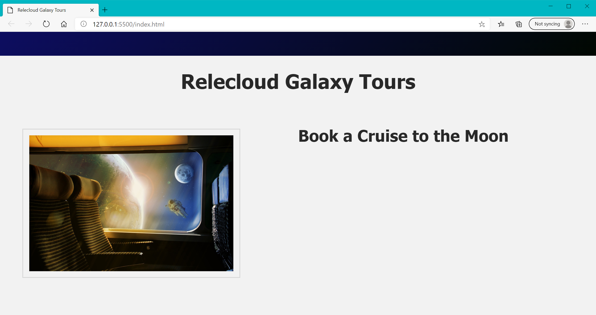
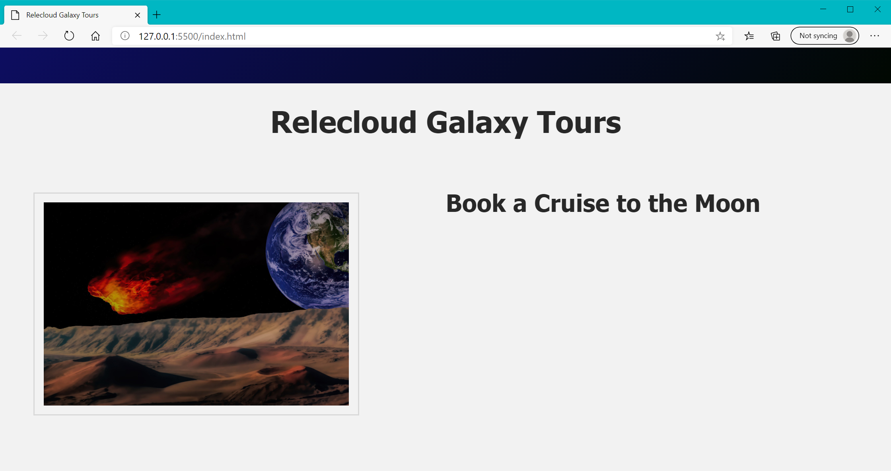

If you completed the prior exercises, your HTML file should look like the image below when viewed in a browser. You can continue to build upon your own files, or you can use the files in our [`starting code`](link).



## Bind an attribute to an expression

At this point the image file that is displayed in the left side of our webpage is bound directly to a standard `img src` attribute. We want to bind that image to a property so we can have Vue change the image source dynamically.

- Add code in your **main.js** file for a property named `selectedProdImg` below the comment that reads `//TODO: Add selectedProdImg`
  - Set default value to `./assets/images/space-4888643_1284x856.jpg`

```javascript
//Create the VueJS app
const app = Vue.createApp({
    data() {
        return {
            productName: 'Book a Cruise to the Moon',
            productDesc: 'Cruise to the moon in our luxurious shuttle. Watch the astronauts working outside the International Space Station.',
            //TODO: Add selectedProdImg
            selectedProdImg: './assets/images/space-4888643_1284x856.jpg',
        }
    }
})
```

Now all we have to do is change the literal `src` attribute in our HTML page to dynamically display any image of our choice. We cannot simply replace the path to our image within double curly braces like we did to display our product name. We need to include the `v-bind` directive to bind the attribute to the data property that is defined in our Vue app. Do this below the comment that reads `//TODO: Set selectedProdImg as src`.

```html
<!-- //TODO: Set selectedProdImg as src -->

```

If you have properly updated your **main.js** file and your **index.html**, the page should look the same as it did in the screenshot above. This may not seem very helpful at this point, but now our HTML interface can be updated dynamically to display a different image within this area of our web interface based on the current value of `selectedProdImg` in our Vue application.

If you were to change the value of `selectedProdImg` in your **main.js** file to `./assets/images/asteroid-5737398_1284x856.jpg` and refresh your browser, the page would look like the image shown below.



## Use shorthand for attribute binding

Vue allows you to use shorthand syntax for v-bind. It essentially allows you to simply use the colon (:) by itself in front of an attribute, which means it is not necessary to include the text `v-bind` within the attribute binding. The result is that the following HTML syntax works just as well as the full v-bind syntax shown above.

```html

```
