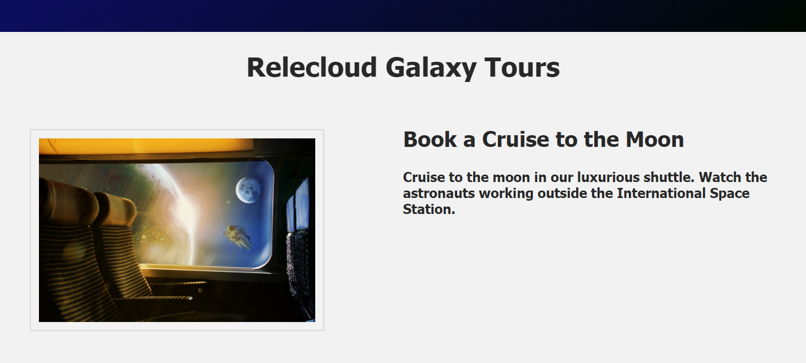

## Simple conditional rendering

Let's start with a simple example to demonstrate conditional rendering. In this section, you will add two `<p>` tags to your HTML page, then direct the browser to display only one of these elements based on whether reservations are still available for a particular product, or whether the product is already booked to capacity.

In your **index.html** file, if you have not already done so by completing the Coding Challenge at the end of the previous module, `//TODO: create an <h3> tag under the <h2> tag for display of a product description, as shown below`.

```html
...
<div class="product-desc">
  <h2>{{ product_name }}</h2>
  <!-- TODO: create <h3> tag for product description. -->
  <h3>{{ product_desc }}</h3>
...
```

`TODO: Also add two properties in your main.js file: product_desc and company_url`, using the example code and text values shown below.

```javascript
...
product_name: 'Book a Cruise to the Moon',
//TODO: Add two properties named product_desc and company_url and assign each a text value
product_desc: 'Cruise to the moon in our luxurious shuttle. Watch the astronauts working outside the International Space Station.',
company_url: 'https://docs.microsoft.com/en-us/learn/',
...
```

>[!NOTE]
>Notice that text values like `product_desc` must be surrounded with quotation marks in your Vue application, whereas boolean and numeric values do not need to be entered between quotes.

`//TODO: Bind the company_url value to the <a href> tag in your HTML file`, as shown in the code snippet below.

```html
...
<div class="product-container">
  <div class="product-images" >
    <!-- //TODO: Bind the company_url to the anchor tag on the selected product image -->
    <a :href="company_url" target="_blank"></a>
  </div>
...
```

Your **index.html** file should now render like the image below. If you click the selected image on the left the browser should open a new page with the URL identified in your **main.js** file.



Next `//TODO: create two new <p> tags under the new <h3> tag using the example code below`. These paragraphs contain content that will be rendered by the browser based on conditions you will specify in your Vue application.

```html
...
<div class="product-desc">
  <h2>{{ product_name }}</h2>
  <!-- TODO: Add <h3> tag for product_desc value. -->
  <h3>{{ product_desc }}</h3>
  <!-- TODO: Add two <p> tags for content that will be rendered based on conditions specified in the Vue app. -->
  <p style="color:green;">Reservations available</p>
  <p><span style="color:red;">Sold out!</span> Please check back for our next available shuttle.</p>
...
```

If you render the HTML file now, you will see the new product description, and both new paragraphs will be displayed underneath, as shown in the image below.


## Conditional rendering directives

We only want one of the two new paragraphs to be displayed in our browser, depending on availability of bookings. In order to create a conditional statement based on some sort of logic, we need to set up a few more properites in our application data() object.

`//TODO: Add a seats_available property in your main.js file, and set the value to "true" to initialize it as a boolean.`

```javascript
...
selected_prod_img: './assets/images/space-4888643_1284x856.jpg',
//TODO: Add a seats_available property and set the value to "true"
seats_available: true,
...
```

## v-if and v-else

Now we can apply the combination of directives `v-if` and `v-else` to display the first paragarph if `seatsAvailable` is true, or instead display the second paragraph if it is false. `//TODO: Modify your HTML file to add a v-if directive to the first <p> tag and a v-else directive to the second <p> tag`, as shown below.

>[!NOTE]
>Notice that the `v-if` directive is written as a full name/value pair, with `v-if` as the name of the directive and `seatsAvailable` in quotes following the equal sign to designate the value of that property, which is fetched from the Vue application file. Since the `v-else` directive will function regardless of any other value for that property, we only need to include the name of the directive in the second paragraph.

```html
...
 <div class="product-desc">
   <h2>{{ product_name }}</h2>
   <h3>{{ product_desc }}</h3>
   <!-- //TODO: Add a v-if directive if seats_available property is TRUE -->
   <p v-if="seats_available" style="color:green;">Reservations available</p>
   <!-- //TODO: Add a v-else directive if seats_available property is FALSE -->
   <p v-else><span style="color: red">Sold out!</span> Please check back for our next available shuttle.</p>
</div>
...
```

This will result in the browser displaying only one of these two paragraphs, depending on whether the value of `seats_available` is set to `true` or `false`. You can test this by changing the value of `seats_available` in your application file. If it is set to `true`, the browser should render a page like the image shown below.


If you change the `seats_available` value to `false`, you should see a page like the image below.


It is technically not necessary to use the `v-else` directive if you do not need to display an alternative. You can simply use a `v-if` statement to either display an element or not. However, if you do use the `v-else` directive it must be located directly **under** the `v-if` directive (i.e., no other HTML tags or lines of code should separate the `v-if` and `v-else` elements).

On the other hand, you could use the simpler `v-show` directive, as explained in the next section.

## v-show

The `v-show` directive provides an easy way to change the visibility of an element rather than completely removing it from the DOM the way `v-if` does. An element on an HTML page can be hidden by using an inline style of `display:none`. The `v-show` directive can be used to change that `display` property to toggle an element's `display` attribute off or on.

Let's add a new paragraph of text to illustrate the `v-show` directive. `//TODO: Add a new <p> tag with v-show directive to display <p> if the Early Bird special is set to "true"`, as shown below.

```html
...
<p v-else><span style="color: red">Sold out!</span> Please check back for our next available shuttle.</p>
<!-- //TODO: Add a new <p> tag with v-show directive to display <p> if the Early Bird special is set to "true". -->
<p v-show="earlybird && num_seats_available > 12" style="color: blue">Early Bird discount 12% if you book by December 20, 2050!</p>
...
```

We want this new paragraph to be displayed whenever we are running our **Early Bird** special. So you also need to `//TODO: create an earlybird property with a boolean value in the data() component of your Vue app`, as shown below:

```javascript
...
seats_available: true,
//TODO: Create an earlybird property with a boolean value
earlybird: false,
...
```

When you display the page in Live View, you will see that the new paragraph containing text about the **Early Bird Discount** is missing. The Vue `v-show` directive accomplishes this by setting a `style` on the `<p>` tag that instructs the browser not to display that paragraph. It will be coded in the HTML page as shown below, which instructs the browser not to display that paragraph.

```html
<p style="display:none">Early Bird discount 12% if you book by December 20, 2050!</p>
```

The paragraph element still exists in the DOM, but it is hidden from display based on that style setting that is added by Vue. This makes `v-show` a good directive to use if you plan to toggle the visibility of an HTML element several times, since it speeds up processing if the element does not need to be removed from the DOM.

If you set the value of `earlybird` to true, you should see a page display like the image below.


