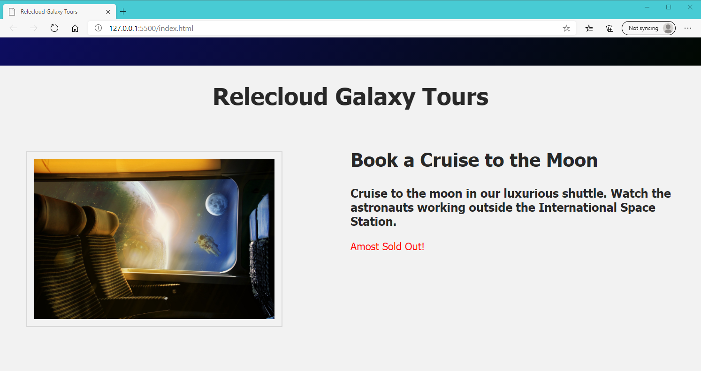

## Combine more than one property value in a conditional directive

Suppose we need to implement complex conditional logic based upon more than just the two options that are available to us when using a boolean value (i.e., true or false). Our problem currently is that the Early Bird discount paragraph will be displayed if `earlybird` is set to "true", regardless of whether reservations are available or cruise seats are sold out.


To control the display more precisely, we can create a new property that is based on a numeric value, which then allows us to create conditional logic based upon a mathematical scale of values. `TODO: Add a new property in your **main.js** file named num_seats_available and set it to a value of 100`, as shown below.

```javascript
...
seats_available: true,
earlybird: false,
//TODO: Create a num_seats_available property with a numeric value 100 so we can perform conditional rendering based on numeric equations
num_seats_available: 100,
...
```

We can ask our Vue application to make a decision based on more than one property and more than one value for a given property. So we can leave the `v-show=earlybird` condition in place on our earlybird paragraph and add more conditional logic using our new numeric variable. `//TODO: Expand the v-show directive in the earlybird paragraph by adding the extra condition shown in the example below`.

```html
...
<h3>{{ product_desc }}</h3>
<p v-if="seats_available" style="color:green;">Reservations available</p>
<p v-else><span style="color:red;">Sold out</span> Please check back for our next available shuttle.</p>
<!-- //TODO: Expand the logic in the v-show directive to display this <p> if earlybird is "true", but only if more than 12 seats are available for booking -->
<p v-show="earlybird && num_seats_available > 12" style="color: blue">Early Bird discount 12% if you book by December 20, 2050!</p>
...
```

This produces the same page display as the one shown above because both conditions are currently being met; i.e., earlybird has a value of "true" AND num_seats_available is 100, which is greather than 12. If we change the num_seats_available value to 11, we will still see the "Researvations available" paragraph, but the earlybird discount will not be displayed. That way our marketing department will not have to worry about changing the value of earlybird manually unless they want to disable the discount for other reasons.

## Layers of Conditional Logic

Now lets display 1 of 3 paragraphs in our HTML interface by using a stacked combination of `v-if`, `v-else-if`, and `v-else` directives based on the **number of seats** available at any given point in time. We want to manage the following conditions:

- Display the first `<p>` tag if more than 12 seats are available for booking; OR
- Display a new 2nd paragraph with the text **Almost Sold Out!** if there are 12 or fewer seats available (but we are not yet fully booked); OR
- Display the **Sold Out!** third paragraph if no seats are available on our space shuttle.
- Furthermore, we have decided not to offer the Early Bird discount if there are 12 or fewer seats available for booking.

To accomplish these objectives, `//TODO: change the <p> tag directives in your index.html to reflect the appropriate v-if, v-else-if, v-else, and v-show directives`, as displayed in the code snippet below.

>[!IMPORTANT]
>It is important to note that the `v-show` directive is placed below the `v-if` through `v-else` directives.

```html
<div class="product-desc">
  <h2>{{ product_name }}</h2>
  <h3>{{ product_desc }}</h3>
  <!-- //TODO: change the <p> tag directives to reflect the appropriate v-if, v-else-if, v-else, and v-show conditions -->
  <p v-if="num_seats_available > 12" style="color:green;">Reservations available</p>
  <p v-else-if="num_seats_available <= 12 && num_seats_available > 0" style="color:red;">Almost Sold Out!</p> 
  <p v-else><span style="color: red">Sold out!</span> Please check back for our next available shuttle.</p>
  <p v-show="earlybird && num_seats_available > 12" style="color: blue">Early Bird discount 12% if you book by December 20, 2050!</p>
</div>
```

In the examples above we have used `>=` or `<` in the mathematical formulas for comparison of the value in `num_seats_available`. It is important to understand that if any of your expressions involve the use of an equals sign, you must use a double equals (`==`) in your expression. For example: `v-show="num_seats_available == 0"`.

You can verify whether your code works as expected by changing the value of the `num_seats_available` property in your **main.js** file and then viewing the HTML output in the browser.

If you enter a **value of 0** for `num_seats_available`, your display should look the image below. The third paragraph (`v-else`) statement is now showing, and the Early Bird discount is hidden.


If you enter a **value of 12** for `num_seats_available`, your display should look the image below. The second paragraph `v-else-if` statement is now showing, but the Early Bird paragraph is hidden.



If you enter **26 as the value**, you should see a display like the screenshot below, which includes the top `v-if` paragraph plus the Early Bird discount statement.


