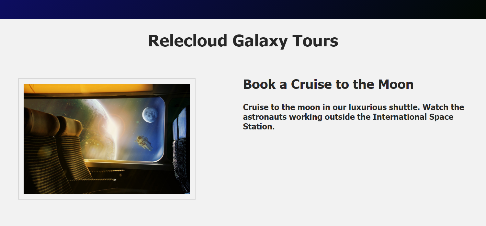
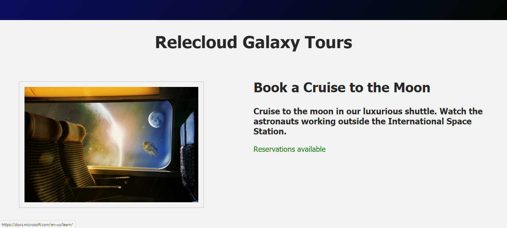

If you completed the prior exercises, your HTML file should look like the image below when viewed in a browser. You can continue to build upon your own files, or you can use the the files in our [`starting code`](link).



## Simple conditional rendering

Let's begin this module with a simple example to demonstrate conditional rendering. We will add some `<p>` tags to our HTML file, then direct the browser to display only one of these elements based on whether reservations are still available for a particular product, or whether the product is already booked to capacity.

Start by entering the new `<p>` tags in your **index.html** file, as shown in the code snippet below.

We only want selected paragraphs to be displayed in our browser, depending on availability of bookings. In order to create a conditional statement based on some sort of logic, we need to set up a few more properites in our application. Set the following new items as data properties in your **main.js** file.

- Add `seatsAvailable` and set the value to "true" to initialize it as a boolean.
- Add `earlybird` and set the value to "false".
- Add `numSeatsAvailable` as a numeric data property with initial value of 100.

```html
...
<div class="product-desc">
  <h2>{{ productName }}</h2>
  <h3>{{ productDesc }}</h3>
  <!-- //TODO: Add <p> tags for content that will be rendered based on conditions specified in the Vue app. -->
  <p style="color:green;">Reservations available</p>
  <p><span style="color:red;">Sold out!</span> Please check back for our next available shuttle.</p>
  <p style="color: blue">Early Bird discount 12% if you book by December 20, 2050!</p>
...
```

```javascript
...
selectedProdImg: './assets/images/space-4888643_1284x856.jpg',
//TODO: Add a seatsAvailable property and set the value to "true"
seatsAvailable: true,
//TODO: Create an earlybird property and set the value to "false"
earlybird: false,
//TODO: Create a numSeatsAvailable property with a numeric value 100 so we can perform conditional rendering based on numeric equations
numSeatsAvailable: 100,
...
```

If you render the **index.html** file now, you will see all new paragraphs displayed underneath the product name and description, as shown in the image below, because we have not yet defined any conditional rendering directives.


## v-if and v-else

Now we can apply the combination of directives `v-if` and `v-else` to display the first paragarph if `seatsAvailable` is true, or instead display the second paragraph if it is false. Modify your HTML file to add a v-if directive to the first `<p>` tag and a `v-else` directive to the second `<p>` tag, as shown in the code samples below.

>[!NOTE]
>Notice that the `v-if` directive is written as a full name/value pair, with `v-if` as the name of the directive and `seatsAvailable` in quotes following the equal sign to designate the value of that property, which is fetched from the Vue application file. Since the `v-else` directive will function regardless of any other value for that property, we only need to include the name of the directive `v-else` in the second paragraph.

```html
...
 <div class="product-desc">
   <h2>{{ productName }}</h2>
   <h3>{{ productDesc }}</h3>
   <!-- //TODO: Add a v-if directive if seatsAvailable property is TRUE -->
   <p v-if="seatsAvailable" style="color:green;">Reservations available</p>
   <!-- //TODO: Add a v-else directive if seatsAvailable property is FALSE -->
   <p v-else><span style="color: red">Sold out!</span> Please check back for our next available shuttle.</p>
</div>
...
```

This will result in the browser displaying only one of these two paragraphs, depending on whether the value of `seatsAvailable` is set to `true` or `false`. You can test this by changing the value of `seatsAvailable` in your application file. When it is set to `true`, the browser should render a page like the image shown below.



If you change the `seats_available` value to `false`, you should see a page like the image below.


It is technically not necessary to use the `v-else` directive if you do not need to display an alternative. You can simply use a `v-if` statement by itself to either display an element or not. However, if you do use the `v-else` directive it must be located directly **under** the `v-if` directive (i.e., no other HTML tags or lines of code should separate the `v-if` and `v-else` elements).

On the other hand, you could use the simpler `v-show` directive, as explained in the next section.

## v-show

The `v-show` directive provides an easy way to change the visibility of an element rather than completely removing it from the DOM the way `v-if` does. An element on an HTML page can be hidden by using an inline style of `display:none`. The `v-show` directive can be used to change that `display` property to toggle an element's `display` attribute off or on.

In your **index.html** page apply `v-show` directive to display the paragraph about the Early Bird special if `earlybird` is set to "true", as shown in the example code below.

```html
...
<p v-else><span style="color: red">Sold out!</span> Please check back for our next available shuttle.</p>
<!-- //TODO: set v-show directive to display <p> if earlybird is set to "true". -->
<p v-show="earlybird" style="color: blue">Early Bird discount 12% if you book by December 20, 2050!</p>
...
```

When you display the page in Live View, you will see that the new paragraph containing text about the **Early Bird Discount** is missing. The Vue `v-show` directive accomplishes this by setting a `style` on the `<p>` tag that instructs the browser not to display that paragraph. Vue will code the HTML page as shown below, which instructs the browser not to display that paragraph.

```html
<p style="display:none">Early Bird discount 12% if you book by December 20, 2050!</p>
```

The paragraph element still exists in the DOM, but it is hidden from display based on that style setting that is added by Vue. This makes `v-show` a good directive to use if you plan to toggle the visibility of an HTML element several times, since it speeds up processing if the element does not need to be removed from the DOM.

If you now set the value of `earlybird` to true, you should see a page displayed like the image below.


