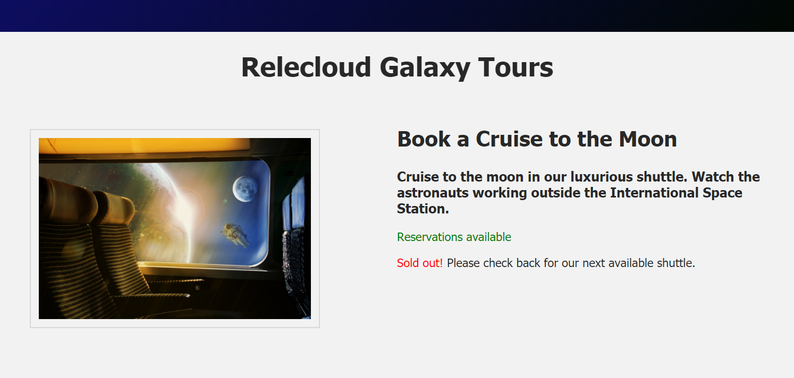

Let's start with a simple example to demonstrate conditional rendering. In this section, we will add two `<p>` tags to our HTML page, and have the browser display only one of these tags based on whether reservations are still available for that particular product, or whether the product is booked to capacity.

In your **index.html** file, create an `<h3>` tag under the `<h2>` tag for display of a product description. Next create two new `<p>` tags under the new `<h3>` tag.

```html
<h2>{{ product_name }}</h2>
<h3>{{ product_desc }}</h3>
<p style="color:green;">Reservations available</p>
<p><span style="color:red;">Sold out</span> Please check back for our next available shuttle.</p>
```

We only want one of the two new paragraphs to be displayed in our browser, depending on availability of bookings. In order to create a conditional statement based on some sort of logic, we need to set up a few more properites in our application data() object. Add a `seatsAvailable` property in your **main.js** file, and set the value to "true" to initialize it as a boolean.

Also add a `product_desc` property to render in the new `<h3>` tag. Your **main.js** file should now include the information shown below.

```javascript
seatsAvailable: true,
product_desc: 'Cruise to the moon in our luxurious shuttle. Watch the astronauts working outside the International Space Station.',
```

>[!NOTE]
>Notice that text values like `product_desc` must be surrounded with quotation marks in your Vue application, while boolean and numeric values do not need to be entered between quotes.

If you render the HTML file now, you will see the new product description and both new paragraphs will be displayed underneath, as shown in the image below.



## v-if and v-else

Now we can apply the combination of directives `v-if` and `v-else` to display the first paragarph if `seatsAvailable` is true, or display the second paragraph if it is false. That section of code in your HTML file would look like the following code snippet.

```html
 <div class="product-desc">
   <h2>{{ product_name }}</h2>
   <h3>{{ product_desc }}</h3>
   <p v-if="seatsAvailable" style="color:green;">Reservations available</p>
   <p v-else><span style="color: red">Sold out!</span> Please check back for our next available shuttle.</p>
</div>
```

>[!NOTE]
>Notice that the `v-if` directive is written as a full name/value pair, with `v-if` as the name of the directive and `seatsAvailable` in quotes following the equal sign to designate the value of that property, which is fetches from the Vue application file. Since the `v-else` directive will function regardless of any other value for that property, we only include the name of the directive.

It is technically not necessary to use the `v-else` directive if you do not need to display an alternative. You can simply use a `v-if` statement to either print something or not print it. However, if you do use the `v-else` directive it must be located directly under the `v-if` directive.

On the other hand, you could use a simpler `v-show` or `v-hide` directive, as explained in the next section.

## v-show

The `v-show` directive provides an easy way to change the visibility of an element rather than completely removing it from the DOM the way `v-if` does. We can toggle an element's `display` attribute off or on. We can "hide" an element using an inline style of `display:none`, and then use `v-show` to change the `display` setting.

Let's use a new paragraph of text to illustrate the `v-show` directive. Add the following `<p>` tag under the previous two paragraphs, as shown below.

```html
<p v-show="earlybird" style="color: blue">Early Bird discount 12% if you book by December 20, 2050!</p>
```

We want this new paragraph to be displayed whenever we are running our **Early Bird** special. So we also need to create an earlybird property in the data() component of our Vue app, as shown below:

```javascript
earlybird: true,
```

When you display the page in Live View, you will see that the new paragraph containing text about the **Early Bird Discount** is missing. Vue accomplishes this by setting a `style` on the `<p>` tag that instructs the browser not to display that paragraph, as shown below.

```html
<p style="display:none">Early Bird discount 12% if you book by December 20, 2050!</p>
```

The paragraph element still exists in the DOM, but it is hidden from display based on that style setting that was added by Vue.

## Add layers of conditional logic

Currently our product description area on the right side of our HTML page is structured like the example below:

```html
<div class="product-desc">
  <h2>{{ product_name }}</h2>
  <h3>{{ product_desc }}</h3>
  <p v-if="seatsAvailable" style="color:green;">Reservations available</p>
  <p v-else><span style="color: red">Sold out!</span> Please check back for our next available shuttle.</p>
  <p v-show="earlybird" style="color: blue">Early Bird discount 12% if you book by December 20, 2050!</p>
</div>
```

Suppose we want to implement more complex conditional logic based upon more than the two options that are available to us when using a boolean value (i.e., true or false). To do this, we want to create a property that is based on a numeric value so that we can create a range of options along a mathematical scale. Add a new property in your **main.js** file named `numSeatsAvailable` and set it to a value of 100, as shown below.

```javascript
const app = Vue.createApp({
    data() {
        return {
          ...
          num_seats_available: 100,
				}
    }
})
```

Now we can display 1 of 3 paragraphs in our HTML interface by using a stacked combination of `v-if`, `v-else-if`, and `v-else` directives.

We want to display the first `<p>` tag if more than 12 seats are available for booking; display a new 2nd paragraph with the text **Almost Sold Out** if there are 12 or fewer seats available, but we are not yet fully booked; or the **Sold Out** paragraph if no seats are available on our space shuttle.

For this purpose, change the `<p>` tags in your **index.html** file as shown below. Notice that we also do not want to display the **Early Bird Special** if no seats are available for booking, and we might not want to offer this discount if there are 12 or fewer seats available for booking. So we add another condition to our existing paragraph that uses the `v-show` directive.

```html
<div class="product-desc">
  <h2>{{ product_name }}</h2>
  <h3>{{ product_desc }}</h3>
  <p v-if="num_seats_available >= 12" style="color:green;">Reservations available</p>
  <p v-else-if="num_seats_available < 12 && num_seats_available > 0" style="color:red;">Almost Sold Out!</p> 
  <p v-else><span style="color: red">Sold out!</span> Please check back for our next available shuttle.</p>
  <p v-show="earlybird && num_seats_available > 12" style="color: blue">Early Bird discount 12% if you book by December 20, 2050!</p>
</div>
```

You can verify whether your code works as expected by changing the value of the `num_seats_available` property and viewing the HTML output in the browser. If you enter **26 as the value**, you should see a display like the screenshot below.


If you enter a **value of 12** for `num_seats_available`, your display should look the image below.


If you enter a **value of 0** for `num_seats_available`, your display should look the image below.

