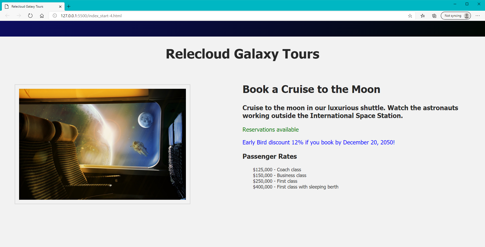
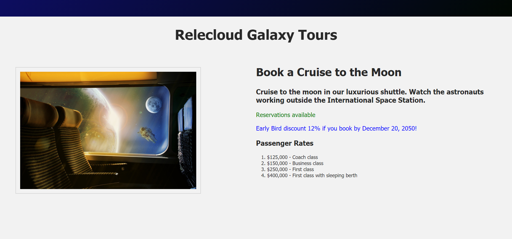

The image below displays the content we have created so far in this training. Currently our `data()` property setting for `num_seats_available` is `0`, so the text in the product detail section informs us that this cruise is "Sold out!", and asks us to check back in February, 2051 to book seats on the next cruise shuttle.

Right now we want to add information about the pricing of different seats available on the cruise shuttle, and it only makes sense to display that information if it is possible to make a reservation. Change the value of `num_seats_available` to `75`. The information display will now reveal more appropriate information, as shown below. This image also includes the list array that we will develop in this learning unit.

First we create an array of pricing data in our **main.js** file, as shown in the code snippet below. Notice that a Vue array is surrounded by brackets. All items are listed on the same line of text, but each item within the array is surrounded by single quotes and followed by a comma (,) separator.

