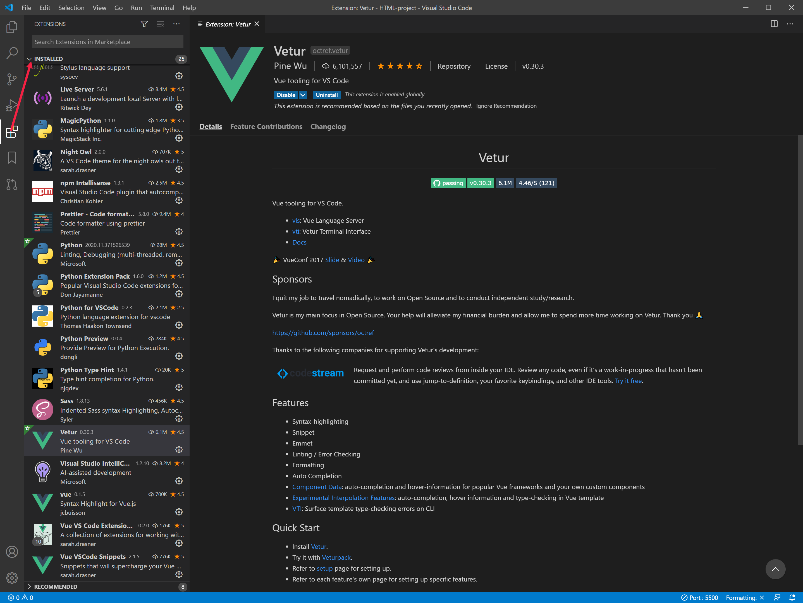
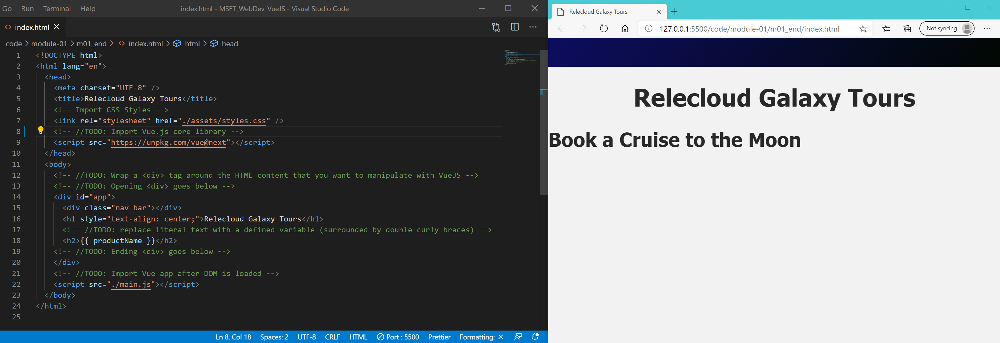

To follow along with the exercises and coding examples described in this learning path, you will want to use a code editor. If you already have a code editor that you prefer to use, **you can skip this module**.

## Free code editors you can use for this project

While a simple text editor such as **Notepad** on a Windows machine or **TextEdit** on a Mac would work, you may want to use an editor that provides functionality such as code-hinting and syntax highlighting. You are of course free to use whatever editor you prefer.

We will demonstrate this project using **VS Code**. You can download and set up a free version of VS Code for the Windows, Mac or Linux platform from the [Visual Studio Code download site](https://code.visualstudio.com/download).

## Extensions to install if you are using VS Code

After completing the VS Code installation, you will also want to install the following extensions:

- Vue (syntax highlighting for Vue.js) - jcbuisson
- Vue VSCode Snippets - sarah.drasner
- Vetur - Vue tooling for VS Code - Pine Wu
- Live Server - Ritwick Dey

You can see a list of installed extensions in VS Code by clicking the four-block icon in the left column of the VS Code interface. You can use the search bar at the top of that column to find a specific extension. Clicking the name of any extension will load a detailed description and installation information in the right panel. Getting started information and instructional videos for VS Code are available at the [Getting started with Visual Studio Code](https://code.visualstudio.com/docs/introvideos/basics) webpage.

## Live preview of HTML pages

You can preview your project by double-clicking your index.html file to open it in a browser on your local computer. However, if you installed the **Live Server** extension in VS Code, you can open a live view of your HTML page that will be updated immediately every time you make a change and save the file. To do this, start the server by clicking the **Go Live** link in the blue footer at the bottom of the VS Code editor.

You will briefly see text indicating that the server is starting, and the Go Live icon will then be replaced with the name of the Port where the live server is running.

## Keyboard shortcuts for Live Server

You can open an HTML page in the live server by using two consecutive keyboard commands: **Alt+L** followed by **Alt+O**. Note that the browser will not be displayed inside the VS Code editor, but rather will appear in a separate browser window. In the image below you can see VS Code on the left and an Edge browser running on live server at the right.

