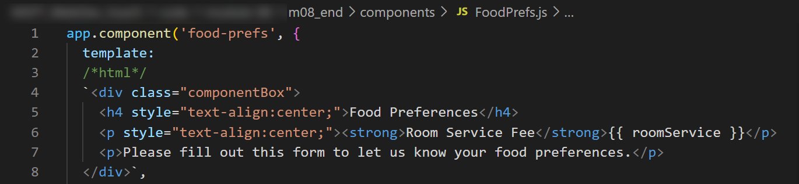
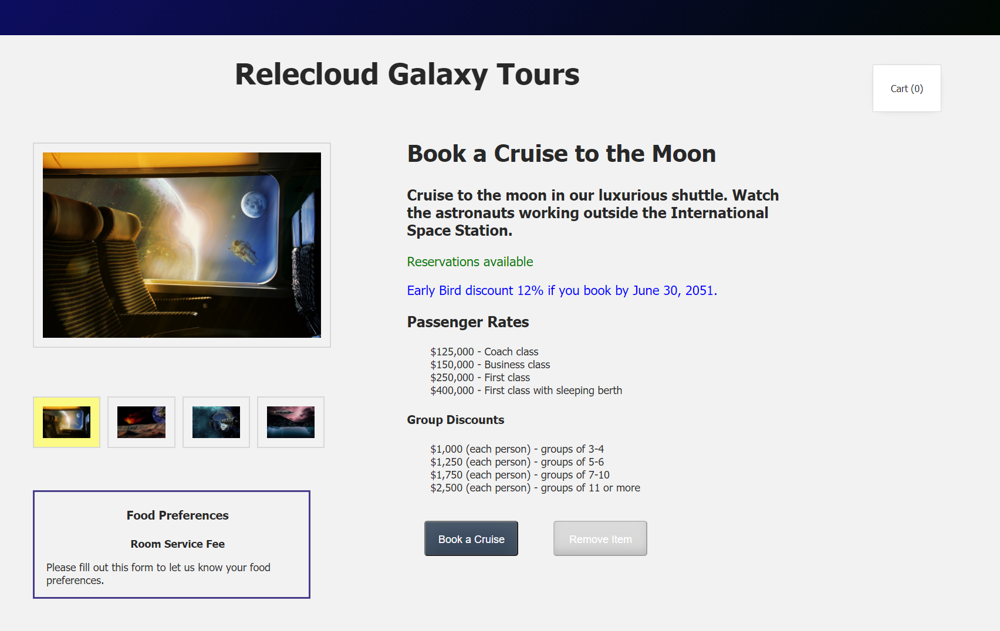

## Components

Components are blocks of code that you can create as separate Javascript files. A parent component can have child components nested within it. You can assemble the components together into a full Vue application interface like the one we have been building in this training, and the assembled components could look like the image we have already created.


The real value of components lies in their reusability. If you have a snippet of content that you might want to use in more than one application or on multiple HTML pages, that is when you might want to create the content as a separate component. In this learning module we will leave our existing content in the **index.html** file and create a small component that we will add to the lower left corner of our existing page.

An app can contain multiple components, so it may be wise to create a components folder to keep these "like items" together. Let's create a simple component.
- Create a folder named `components`.
- Create a file in the `components` folder named `FoodPrefs.js`.
- In the **FoodPrefs.js** file create an app component named `food-prefs`.
- Add the `template` property, which allows you to create the HTML components to be displayed in your application interface.
- Add an HTML comment on the next line if you are using **VS Code** as your code editor. This activates the `es-6-string-html` extension for VS Code, which displays your HTML code with syntax highlighting. Without this extension your HTML code will look like the code snippet shown below, where all HTML content is displayed in the same color within your Javscript file.
- Create a `<div>` tag with a class named `componentBox`. Notice that the HTML components are surrounded with a backtick at the beginning and end of the `template` contents
- Add an `<h4>` tag with a centered heading that reads `Food Preferences`.
- Add two additional `<p>` tags as shown in the code snippet below.

```javascript
app.component('food-prefs', {
  template: 
  /*html*/
  `<div class="componentBox">
    <h4 style="text-align:center;">Food Preferences</h4>
    <p style="text-align:center;"><strong>Room Service Fee</strong>{{ roomService }}</p>
    <p>Please fill out this form to let us know your food preferences.</p>
  </div>`,
})
```

If you are using VS Code and you installed the `es-6-string-html` extension, your **FoodPrefs.js** file will look similar to the image shown below, where the HTML components are displayed with syntax highlighting. This will only occur if you add the `/*html*/` comment above the HTML components that define the `template` contents.



- Add two `componentBox` classes to your **styles.css** file (in the **assets** folder) below the comment that reads `/* TODO: Add componentBox classes*/`, as shown below.

```css
...
/* TODO: Add componentBox classes*/
.componentBox {
	margin-top: 0;
  width: 66%;
  margin-left: 40px;
  padding-left: 20px;
  padding-right: 14px;
  padding-top: 0;
  border: darkslateblue;
  border-style: solid;
  font-size: 18px;
}

.componentBox p, li {
  font-size: 18px;
}
...
```

Now we are ready to add this component to our **index.html** file. The first step is to import the new component Javascript file into our application interface.
- Add the following code below the comment that reads `TODO: Import Vue components`.

```html
...
    <!-- Import Vue app after DOM is loaded -->
    <script src="./main.js"></script>

    <!-- TODO: Import Vue components -->
    <script src="./components/FoodPrefs.js"></script>

    <!-- Mount Vue App to the DOM -->
    <script>
      const mountedApp = app.mount('#app')
    </script>
  </body>
</html>
```

Now that the content of the component has been imported, we need to tell our HTML page where to display that content. We essentially create a set of opening and closing tags that use the name of the app component we created in the Javascript file (in this case, **food-prefs**).
- Add the `<food-prefs>` tags below the comment that reads `TODO: Add component`.

```html
...
<!-- TODO: Add component -->
<food-prefs></food-prefs>
...
```

If you render the HTML file now you should see an image like the one shown below, where the new component is displayed in the bottom left corner of the screen below the thumbnail images.



Note that we have not yet defined a data property for `roomService`, so nothing is currently being displayed at the end of the paragraph that reads "Room Service Fee". We will add that property in the next section by applying a prop.
