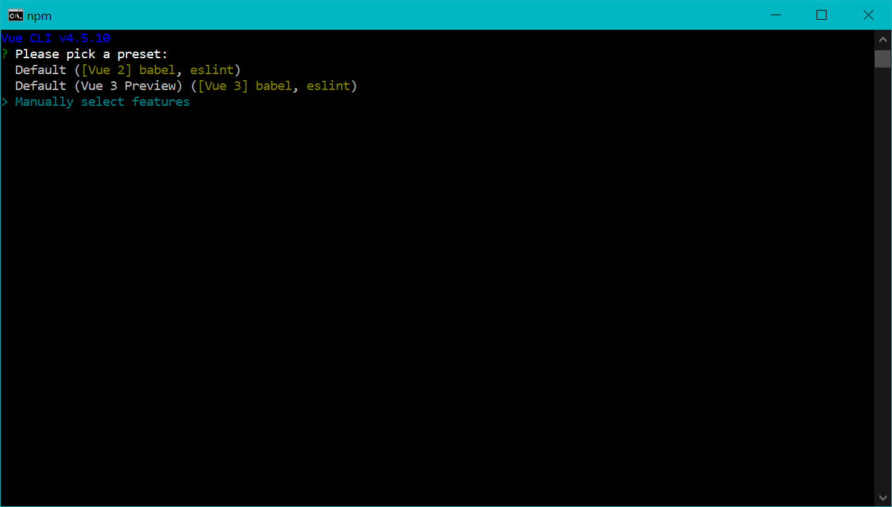
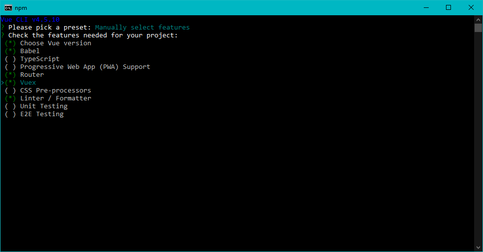
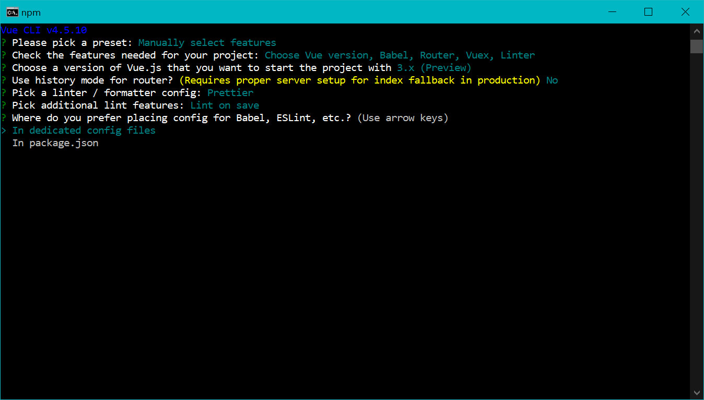
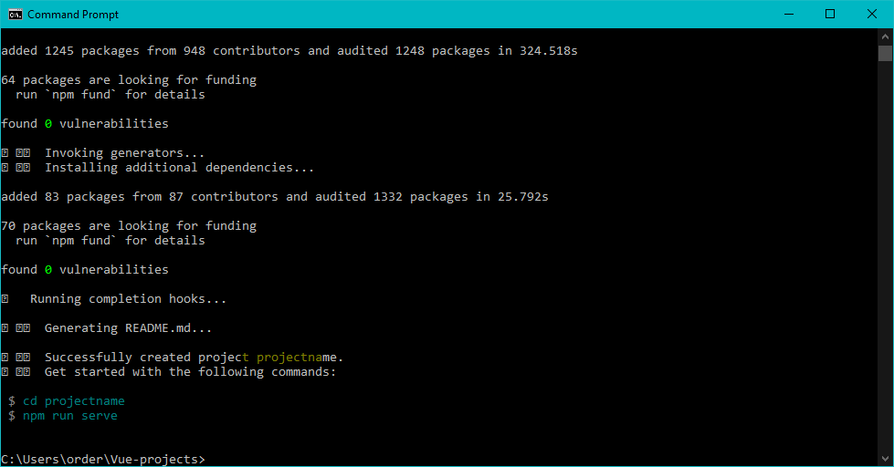
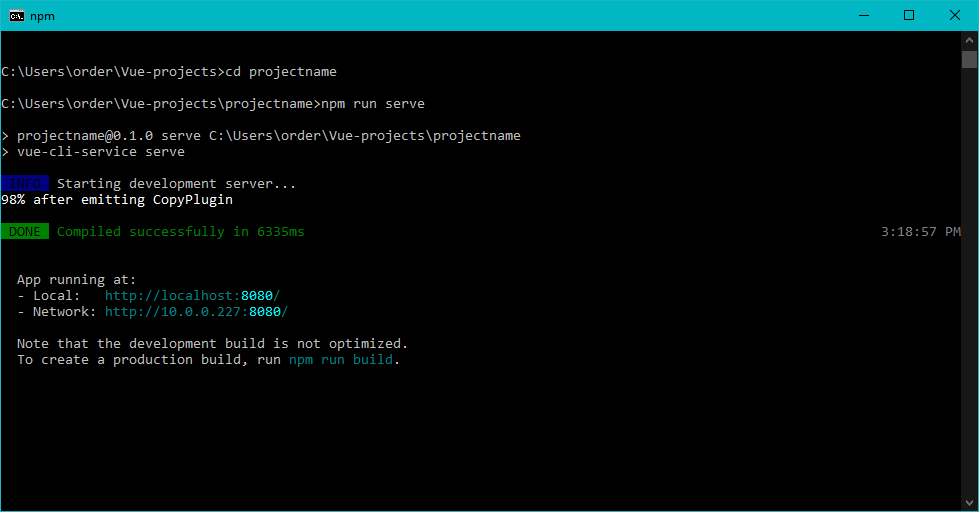
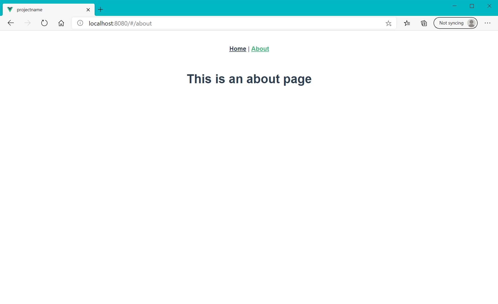

This section demonstrates how to use the Vue CLI to build a starter project that provides a skeleton framework that you can use to rapidly deploy a Vue application. In the next section we will demonstrate how to build a starter project using the Vue graphical user interface (UI).

Some of the advantages of using the CLI to create a Vue project include the statements listed below. The CLI:
- Selects the libraries that your project will use.
- Configures Webpack, so that all JavaScript files, CSS files and other dependencies get properly bundled together and optimized for deployment. This can reduce loading speed for your application.
- Allows you to use single-file `.vue` components, `TypeScript`, `SCSS`, `Pug` and the latest versions of `ECMAScript`.
- Enables Hot Module Replacement (HMR), which performs live update of your application whenever you save a change.

In order to use Vue CLI, you will need to run `npm`, which is the package manager for `Node.js` modules. If you have already downloaded Node.js, you automatically have npm installed on your computer. To check whether you have Node.js and npm installed, run the commands shown below in your terminal.

> [!HINT]
>HINT: On a Windows computer you can use the `Command Prompt` terminal interface. On a Mac computer you can use the `Terminal` app.

```bash
node -v
``` 
```bash
npm -v
```


- Response to the command `node -v` indicates that version 14.15.1 of **Node.js** is installed on this computer.
- Command `npm -v` reveals that version 6.14.8 of **npm** is installed.

## Install Node.js and npm

If your terminal does not return the version number for each package, you can download and install **Node.js** and **npm** from the [Node.js website](https://nodejs.org/).

## Install Vue CLI

After completing the installation instructions on the **Node.js** website and **confirming** that both `Node.js` and `npm` are installed, you can install the `Vue CLI` from your terminal using the following command:

```bash
npm install -g @vue/cli
```

On a Windows computer these files will likely be located at: `C:\Program Files\nodejs\node_modules\npm`.

On a Mac computer these files will likely be located at: `/usr/local/lib/node_modules/@vue/.`
## Create a project

After installation of the Vue CLI, you can create your project in two different ways:
- using commands in a terminal
- using the Vue UI

First, we will walk through the steps involved in creating a project using the Vue CLI. Note that whatever you use as the `projectname`, Vue will create a folder on your computer with the projectname as the `folder` name. Vue will place several starter files in that folder that will help you jumpstart the development process for creating a Vue application.

Execute the following command in the terminal:
- `vue create projectname` (where `projectname` is the name of the folder you want to create for your project).

```bash
vue create projectname
```

You will be asked to set several options (preferences) before the project is created. Use the `arrow key` to move to the appropriate option **before** you hit the `Enter` key.

- Start by picking a `preset`.
  - Press the arrow key to move the cursor down to the `Manually select features` option and hit the `Enter` key.



- Features needed for your project include:
  - `Babel` (already selected)
  - `Router` (select by hitting `spacebar`)
  - `Vuex` (select by hitting `spacebar`)
  - `Linter / Formatter` (already selected)



- Choose version `3.x (Preview)` of Vue.js to start the project with.
- For linter / formatter config choose `ESLint + Prettier`.
  - Select `(*) Lint on save`.
- Where do you prefer placing config for Babel, ESLint, etc.?
  - Select `In dedicated config files`.



The next step would be to **change** to the `directory` where your project is located, using the command shown below. Note that suggested commands are shown at the bottom of the confirmation screen that indicates your project was created successfully.



Execute the commands shown below.

```bash
cd projectname/
npm run serve
```


Your project has been `built` and is now `served` at [http://localhost:8080](http://localhost:8080). Per the instructions at the bottom of the previous terminal window, the "development build is not optimized", so you may choose to run the build command shown below.

```bash
npm run build
```

The starter project includes two pages (Home | About), which you can navigate between because your application is using `Vue Router`. We will discuss the `router` in more detail after we demonstrate how to set up a project using the Vue UI in the next section.




> [!IMPORTANT]
> IMPORTANT NOTE: You will want to leave the terminal window open while you are working with the Vue application files on the localhost server. When you close the terminal window you will be ending the server instance.
