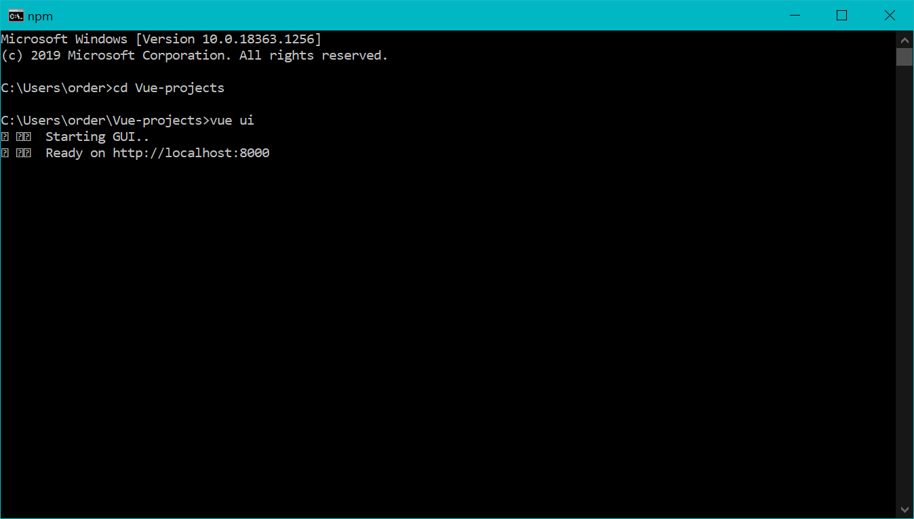
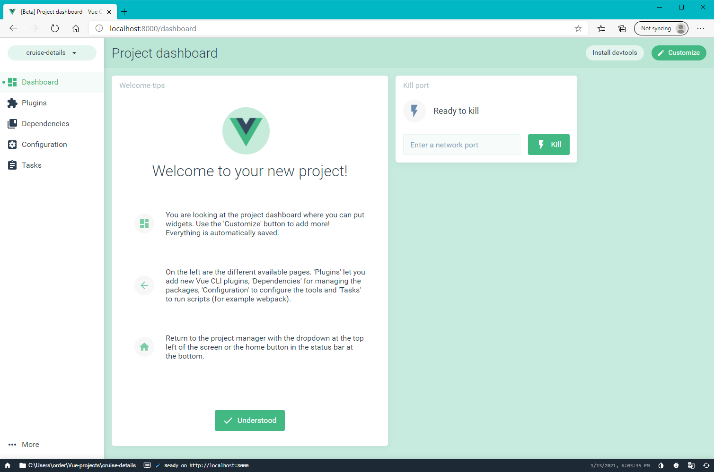
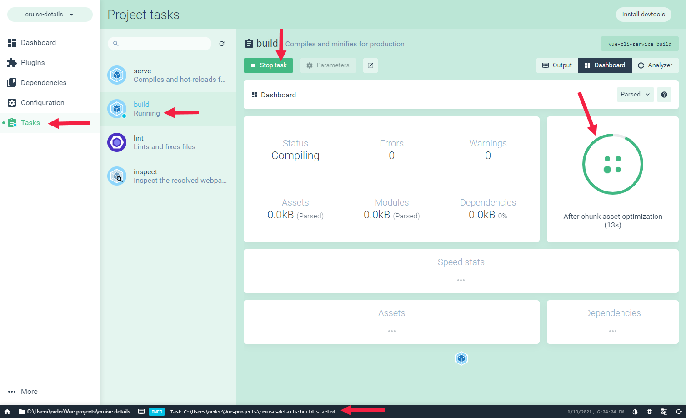
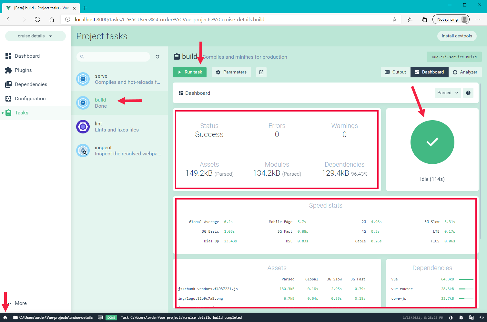
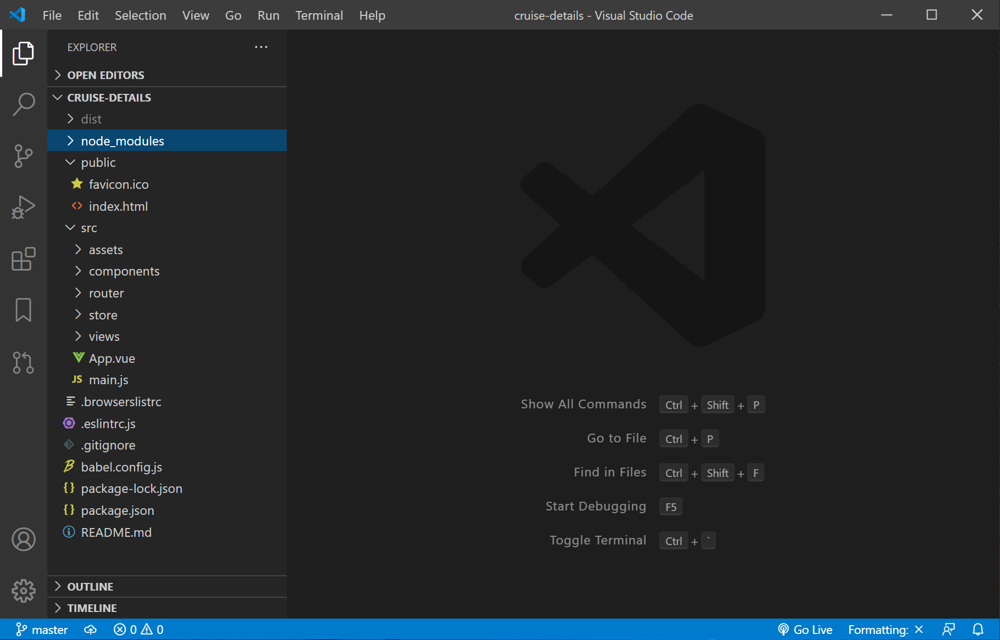

In the previous section we developed a Vue project using the `Vue CLI` (Command Line Interface). In this section we will build a new project using the Vue graphical user interface (`Vue UI`).

Start by changing to the directory location where you want to save your project. Then execute the command `vue ui` in the terminal, as shown below.

```bash
vue ui
```



Once you see the message `Ready on http://localhost:8000`, your default browser will open to display the Vue **Project dashboard**. Leave the terminal window open, as the `localhost` version of your Vue project will no longer run in the browser after the terminal window is closed.



The Project dashboard contains several types of information, with links to each area available in the left navigation panel. If you click the `Plugins` link you will see the plugins that are installed by default when new projects are created. These typically include:
- @vue/cli-service
- @vue/cli-plugin-babel
- @vue/cli-plugin-eslint
- @vue/cli-plugin-router
- @vue/cli-plugin-vuex

You can change these default settings if you wish, and you can easily add another plugin by clicking the `+ Add plugin` button at the top right of the screen.

Project dependencies can be accessed by clicking the `Dependencies` link. On this screen you will find two types of dependencies:
- Main dependencies, which include the core JavaScript files needed to provide Vue functionality.
- Development dependencies, which are optional functionalities that assist you in the development process.

If you click the `Configuration` tab you will be able to make changes in the General settings that have been established by default.

The `Tasks` tab is where you will do most of your work. Click the `Run task` button to `build` a project (i.e., to compile a project for `production`). The `Run task` button will immediately be changed to a `Stop task` button, so you can interrupt this build task if needed. You will be able to see data being generated in the bottom panels while the build is being executed. A notice will appear in the status bar at bottom left of the screen to let you know that the build has started.



When the build is completed, you will see the final statistics in the lower panels on the right.



You can access the `Vue Project Manager` screen by clicking the icon of a house in the status bar in the far left corner at the bottom of your screen. The `Projects` tab contains a listing of all your Vue projects. Now that you have run the "build" task you will be able to create a project by clicking the `+ Create` link in the menu bar at the top of the screen.

- Click `+ Create`
- Select a project folder
- Click the `Create a new project here` button
- Type a `project name` in the Project folder
- Leave "Default" as the Package manager
- You can optionally initialize a git repository
- Select presets
  - Choose Manual
- Select Router
- Select Vuex
- Linter / Formatter is already selected
- Scroll to bottom and select "Use config files"
- Click Next button
- Leave "Lint on save"
- Click the Select dropdown and choose "ESLint + Prettier"
- Click "Create Project" button

Optionally you can save these settings as a new preset, or just click "Continue without saving". The project creation process will begin, and you will see messages while the process is running.

```html
 Installing CLI plugins. This might take a while...
  ... Creating project
  ... Installing additional dependencies
```

Once the installation is complete you will see a list of the "Installed plugins".

If we return to the **Vue Project Manager** screen by clicking the house icon, the project we just created will now be listed on that screen.


- If you have previously created a project you can import it here using the `Import` link in the top navigation menu.
- For any project that is listed in the Vue Project Manager you can click the `Open in editor` link if you would like to open the project files in VSCode for editing.


